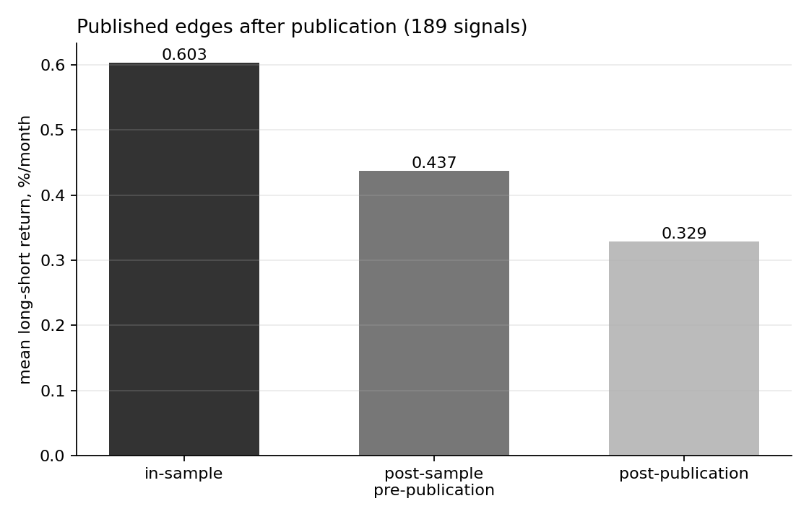
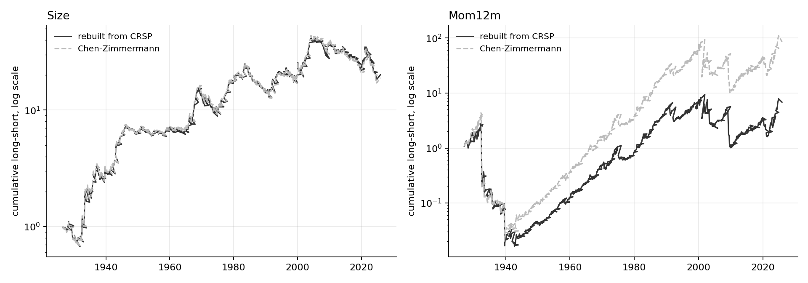

# Alpha Decay: the half-life of a market edge

How fast does a published equity-market anomaly stop working once it is public?

**Headline result.** Across the 189 usable signals in the Chen–Zimmermann universe
(1926–2024, 173,302 signal-months), the mean monthly long-short return falls from
**0.603%** inside the publishing paper's own sample to **0.329%** after publication — a
**45% decline**. The median signal loses **53%**. McLean and Pontiff (2016) reported 58%
on 97 anomalies; this is that number, recomputed on a universe twice the size and extended
to the end of the current data.



> **The full write-up is in [`paper/alpha-decay.qmd`](paper/alpha-decay.qmd)** — the
> question, the estimand, the estimator derived in LaTeX, the code that implements it,
> the number, and the test the number has to survive, with maths and code interleaved.
> `quarto render paper/alpha-decay.qmd` builds it. No number in its prose is typed by
> hand: every one is computed by a chunk or read out of a file in `output/`, and the last
> chunk fails the render if the document and the scripts ever disagree.

Between the 1980s and today, several hundred cross-sectional return predictors have been
documented in the finance literature. If those edges are real risk premia, publication
should not change them. If they are mispricing, publication should destroy them — because
publication is precisely the moment when enough capital learns about them to trade them
away.

This project reruns that question on the current universe and then asks the part the
original paper left open: **not how much decays, but how fast, and to what floor.**

## The design

Each signal's history is cut into three windows using the publishing paper's own dates:

| window | definition | what it isolates |
|---|---|---|
| 1. in-sample | up to the paper's `SampleEndYear` | the edge as originally reported |
| 2. post-sample, pre-publication | sample end → publication year | discovered, not yet public |
| 3. post-publication | publication year onward | public, and being traded on |

The middle window is what makes this a test rather than a description. If decay is caused
by *publication*, window 2 should look like window 1 and only window 3 should fall. If it
is caused by the original sample being lucky — overfitting, data mining, selection — then
window 2 is already lower before anyone outside the authors knew.

**Composition is held fixed.** A signal enters only if its paper's sample ends strictly
before publication *and* it has at least 24 monthly observations in **every** window. The
same 189 signals therefore appear in all three bars, so the decline cannot be an artefact
of the sample changing between windows.

## Results

`python 02_decay_panel.py` — runs in about a second, needs only pandas, numpy, matplotlib.

### Three windows, equal-weighted across 189 signals

| window | mean, %/month | median, %/month | mean vs. window 1 |
|---|---|---|---|
| in-sample | 0.603 | 0.507 | — |
| post-sample, pre-publication | 0.437 | 0.347 | −28% |
| post-publication | 0.329 | 0.237 | **−45%** |

The mean falls less than the median (−45% against −53%) because a minority of signals
survive more or less intact and pull the average up. Decay is not uniform: **151 of 189
(80%)** earn less after publication than in sample, and **32 (17%)** have an outright
negative mean long-short return once public.

### Panel regression

r_it = a_i + b₁·postsample_it + b₂·postpub_it + e_it

Signal fixed effects are absorbed by within-demeaning, so b₁ and b₂ come from variation
over time *within* a signal rather than from some signals being stronger than others.
Standard errors are clustered by **date** (1,188 clusters), because in any given month
every long-short portfolio is exposed to the same market. The cluster-robust covariance is
written out in `02_decay_panel.py` rather than called from a library.

| | full panel (212 signals) | matched panel (189) |
|---|---|---|
| b₁ post-sample | −0.1449 (se 0.0747, t = −1.94) | −0.1277 (se 0.0752, t = −1.70) |
| b₂ post-publication | −0.2718 (se 0.0531, **t = −5.12**) | −0.2518 (se 0.0548, t = −4.60) |
| implied decline | −24% and −45% | −21% and −42% |

### What this does *not* show

The tempting conclusion is that publication, rather than overfitting, is what kills the
edge: b₂ is sharply estimated and b₁ is not. That conclusion does not survive a test.
Imposing the linear restriction b₂ = b₁ on the same clustered covariance matrix:

| | b₂ − b₁, %/month | se | t |
|---|---|---|---|
| full panel | −0.1269 | 0.0761 | **−1.67** |
| matched 189 | −0.1241 | 0.0755 | −1.64 |

The *incremental* effect of publication, over and above the decline that had already
happened by the time the original sample ended, is **not significant at the 5% level**. So
the three-window design as run here does not separate the arbitrage channel from the
data-mining channel on this universe. The point estimates are consistent with publication
mattering; the difference is not sharp enough to claim it.

McLean and Pontiff get a cleaner separation (−26% against −58%) on 97 anomalies. This
universe is twice as large and includes weaker and less-replicated signals, which is the
obvious first explanation and is the next thing to check by re-running on their 97.

## Validating the inputs: rebuilding two signals from raw CRSP

Result 1 takes Chen–Zimmermann's long-short returns as given. That is a dependency, and an
untested one: everything above rests on 189 series somebody else computed. So two signals
were rebuilt from scratch out of CRSP security-level data and checked month by month against
the published versions — `Size`, about the simplest anomaly there is, and `Mom12m`, which
has a formation window, a skip month and overlapping holding periods and is therefore easy
to get subtly wrong.

`03_crsp_pull.py` builds the panel; `04_build_anomalies.py` constructs the signals and scores
them. **These two scripts need a WRDS subscription. Result 1 does not.**

### The panel

CRSP monthly, **1926-01 to 2026-06, 27,006 securities**, pulled through the WRDS Postgres
interface in decade chunks to parquet.

The tables are not the ones most replication code on the internet uses. CRSP has finished
migrating from the legacy SIZ layout to CIZ, and February 2025 was the last SIZ release, so
`crsp.msf`, `crsp.msenames` and `crsp.msedelist` are gone:

| legacy (SIZ) | current (CIZ) |
|---|---|
| `crsp.msf` | `crsp.stkMthSecurityData` (`crsp.msf_v2`) |
| `crsp.msenames` | `crsp.stkSecurityInfoHist` (`crsp.stocknames_v2`) |
| `crsp.msedelist` | `crsp.stkDelists` |

Three things in that migration change the answer rather than just the spelling:

1. **Delisting returns are already inside `mthret`.** CRSP's own SIZ-to-CIZ field map sends
   `MDLRET` into `MthRet` with a `Recalc/DelistConv` note. Merging `stkDelists` on top of the
   return — which is what every pre-2025 replication script does — double-counts the
   delisting adjustment.
2. **`shrcd in (10,11) and exchcd in (1,2,3)` no longer exists.** The US common-stock screen
   is now eight fields: `sharetype='NS'`, `securitytype='EQTY'`, `securitysubtype='COM'`,
   `usincflg='Y'`, `issuertype in ('ACOR','CORP')`, `primaryexch in ('N','A','Q')`,
   `conditionaltype='RW'`, `tradingstatusflg='A'`.
3. **Use `mthcap`, never `abs(prc) * shrout`.** CRSP stores a negative price when the figure
   is a bid-ask average rather than a trade, so taking the absolute value is a habit that
   hides exactly the thing the sign is there to flag.

Two sanity checks run at the end of the pull: 7,235 distinct US common stocks in 2000, and a
13.5% equal-weighted mean annual return 1963-2024. Both pass. The same panel puts the count
today at roughly 3,700 — about half the 2000 number.

### The two signals, against the published series

Implementation parameters are read out of `SignalDoc.csv` at runtime rather than typed in:
sign, weighting, quantile cut, holding period. Guessing them and then comparing would be
comparing two different strategies and calling the difference a replication failure.



| | rebuilt | Chen–Zimmermann | difference | correlation |
|---|---|---|---|---|
| **Size** (EW, halves, hold 12) | 0.324 %/month | 0.322 | **+0.002** (t = +0.16) | **0.992** |
| **Mom12m** (EW, deciles, hold 1) | 0.791 %/month | 0.900 | −0.107 (t = −1.82) | 0.972 |

Size reproduces essentially exactly, across 1,182 months and a century. Momentum reproduces
in shape and comes in 12% light in level.

**That 12% is not statistically distinguishable from zero.** A momentum long-short series is
volatile, and so is the month-by-month difference between two implementations of one: the gap
has a standard deviation of 2.03 %/month, so a mean of −0.107 over 1,174 months carries
t = −1.82. Before 1963 it is t = −0.74; from 1963 on, t = −1.94. Neither era rejects equality
at the 5% level.

Where the difference sits is more informative than its size. The 60 largest-|gap| months -
5% of the sample — carry **100%** of the mean difference. Drop the largest decile of months
and the full-sample gap falls to −0.051, while the pre-1963 gap flips sign to **+0.067**. The
rebuilt series is below the published one in 53% of months, a coin flip. And the offending
months are the ones anyone would name in advance: 1931-01, 1932-12, 1939-09, 1939-11, 1942-01,
1943-01, 2008-12 and 2009-03 — momentum crashes and the rebounds that follow them, when the
extreme deciles turn over violently and a single imputed price or mid-holding-period delisting
moves a bucket mean by percentage points. 2009-03 is the single worst month on record for
momentum and 1939-09 is the outbreak-of-war rebound; both are exactly where two implementations
of a decile sort should be expected to part company.

So the residual is a tail phenomenon concentrated in a handful of crash months, not a
systematic wiring error. **A data-coverage explanation was the obvious guess and the data
reject it**: the gap is −0.092 before 1963, when CRSP covers NYSE only, and −0.116 after,
when it covers three exchanges. Thin early data is not what this is.

### What the rebuild caught

Two conventions that occupy one line of documentation each and change the answer by more than
the anomaly is worth:

- **The skip month.** SignalDoc defines Mom12m over "months t-12 and t-1" — month t is
  excluded. Forming on t-11..t instead pulls short-term reversal into the signal and cancels
  the premium outright: the monthly-rebalanced long-short mean goes from 0.791 to −0.009
  %/month. Correlation with the published series stayed at 0.974 throughout, which is the
  trap. Correlation confirms that the wiring is right; it says nothing about whether the
  signal is.
- **The holding period.** `Portfolio Period` does mean months held, with overlapping cohorts,
  and it is right for Size (hold 12 gives +0.002 against monthly's +0.005) but wrong for
  Mom12m (the documented hold 3 gives 0.652, further off than monthly's 0.791). Correlations
  across these variants differ by 0.005, so only the level can choose between them.

No screen variants were tried. Searching filters until the number matches is curve-fitting the
replication, and the position without it is defensible on its own: one signal reproduces
exactly, the other reproduces to within sampling error.

## What comes next

- **Re-run on the McLean–Pontiff 97**, to see whether the channel separation is a
  universe-composition effect.
- **Decay rate and half-life per signal.** A three-window average says the edge fell; it
  does not say how quickly, or whether it fell to zero. Fitting a state-space model to each
  signal's post-publication path returns a decay rate, a half-life and a long-run floor —
  each with a standard error rather than a curve fitted by eye.
- **Zero or a floor?** Grossman and Stiglitz (1980) implies the floor should be positive:
  if an anomaly's return went to exactly zero, nobody would be paid to arbitrage it and it
  would reappear. Estimating the floor is a test of that.
- **Staggered treatment.** Publication arrives at a different date for every signal, so the
  publication effect should be estimated with Callaway–Sant'Anna and Sun–Abraham estimators
  rather than the two-way fixed-effects specification used above and in the original
  literature.
- **Cross-section of decay speed** against arbitrage-cost proxies — Amihud illiquidity,
  size, idiosyncratic volatility, short interest (`comp.sec_shortint`), institutional
  ownership (`tfn` 13F) — which is where the story about *why* edges die gets tested rather
  than asserted. All of these are computable from the panel the CRSP section already built. That is
  why that section exists: it is the data layer for this one, and it has now been validated
  against a published series rather than assumed correct.
- **A second, independent universe.** `contrib.global_factor` (Jensen–Kelly–Pedersen) carries
  153 characteristics across 93 countries from 1985. If an edge decays after publication
  because capital arbitrages it away, the decay should be weaker in markets that capital
  reached later — a cross-country test the US-only data cannot run.

## Data

Two public files from the Chen–Zimmermann Open Source Asset Pricing dataset
(<https://www.openassetpricing.com>, Data tab), placed in `data/`:

    data/PredictorLSretWide.csv   monthly long-short returns, one column per signal (3.3 MB)
    data/SignalDoc.csv            one row per signal: acronym, journal, year, sample dates

- `PredictorLSretWide.csv` is *Featured Portfolio Return Datasets → Monthly portfolio
  returns → "Monthly long-short returns of 212 predictors following OPs (wide csv)"*.
- `SignalDoc.csv` is under *Documentation → "Signal Documentation csv file"*.

**Release used: October 2025, v2.0.0.** Most series run through December 2024;
option-implied-volatility predictors end December 2022. This is the first release in which
all signals are produced by the authors' Python translation rather than the original Stata
code; `ChNAnalyst`, `PriceDelayTstat` and `Recomm_ShortInterest` carry major revisions from
bug fixes in that translation, and all three are in the universe used here.

`data/` is gitignored — the files are not mine to redistribute and the download takes a
minute. **No WRDS subscription is required for Result 1.**

The CRSP rebuild additionally uses **CRSP monthly stock data** and the Fama–French factors, pulled
from WRDS by `03_crsp_pull.py` into `data/crsp_monthly.parquet` (97 MB) and
`data/ff_factors_monthly.parquet`. That does require a subscription, and neither file is
committed. The WRDS username is read from the `WRDS_USERNAME` environment variable or
prompted for; no credential is written into any file in this repository.

## Running it

```bash
python 01_first_figure.py inspect   # what the raw files actually contain
python 01_first_figure.py figure    # one anomaly, publication date marked
python 02_decay_panel.py            # Result 1: the three-window decay, all signals
```

Writes `output/result1_summary.txt`, `output/result1_windows.csv` (one row per signal) and
`output/fig02_decay.png`. Runs in about a second on pandas, numpy and matplotlib alone.

The CRSP rebuild needs WRDS and the `wrds` package, and runs in that order:

```bash
python 03_crsp_pull.py              # CRSP monthly panel, by decade, restartable
python 04_build_anomalies.py        # rebuild Size and Mom12m, score against Chen–Zimmermann
```

Writes `output/rebuild_summary.txt`, `output/rebuild_Size.csv`,
`output/rebuild_Mom12m.csv` and `output/fig04_rebuild.png`. The pull takes a few minutes and
resumes from whatever decade files already exist; the rebuild takes about a minute.

## Notes on method

Decisions that change the answer are recorded in `DECISIONS.md` rather than buried in the
code. As run: signals the original authors categorise as placebos are excluded; a signal
must have at least 24 monthly observations in every window; returns are equal-weighted
across signals; and the event date is the publication year given in `SignalDoc.csv`, not
first working-paper circulation — which, if informed traders act on working papers, makes
the estimated post-publication decline a **lower** bound on the true one.

The small-sample correction on the clustered covariance is (G/(G−1))·((n−1)/(n−k)) with
k = 2; it does not subtract the absorbed fixed effects from the degrees of freedom, which
with n = 173,302 changes the standard errors by about 0.1%.

## Reference

Chen, A. Y. and T. Zimmermann (2022), "Open Source Cross-Sectional Asset Pricing",
*Critical Finance Review*.

McLean, R. D. and J. Pontiff (2016), "Does Academic Research Destroy Stock Return
Predictability?", *Journal of Finance* 71(1), 5–32.

Grossman, S. J. and J. E. Stiglitz (1980), "On the Impossibility of Informationally
Efficient Markets", *American Economic Review* 70(3), 393–408.
