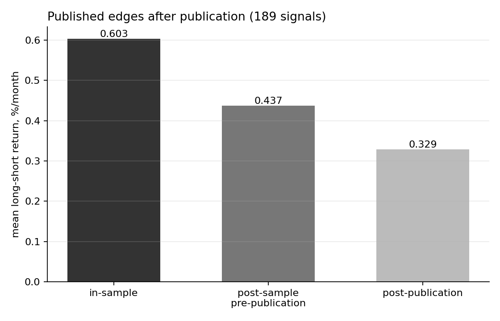
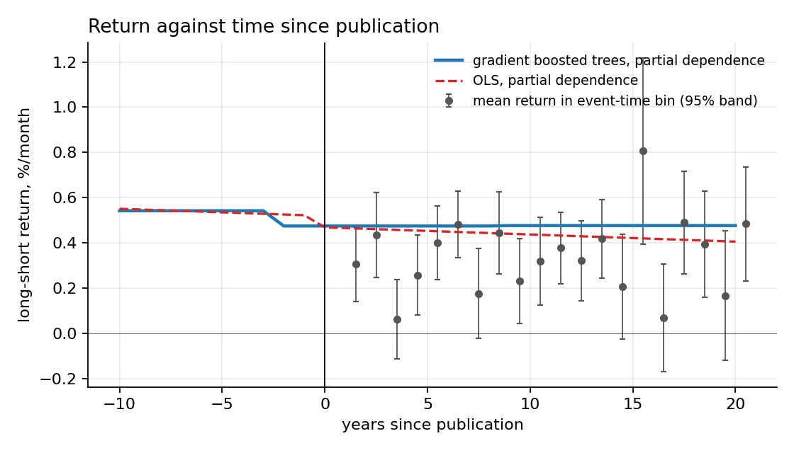

# Alpha Decay: the half-life of a market edge

How fast does a published equity anomaly stop working once it is public, and can anyone
tell in real time which published signals will keep paying?

**Paper:** <https://tugsuz.github.io/alpha-decay/> ([PDF](https://tugsuz.github.io/alpha-decay/alpha-decay.pdf)).
Source in [`paper/alpha-decay.qmd`](paper/alpha-decay.qmd); every number in it is computed
when the page is rendered, from the two public Chen and Zimmermann files or from result
files written by the scripts here.

## Results

**Decay.** Across the 189 usable signals in the Chen and Zimmermann universe (1926 to 2024),
the mean monthly long-short return falls from 0.603% inside the publishing paper's own
sample to 0.329% after publication, a 45% decline. The median signal loses 53%. McLean
and Pontiff (2016) reported 58% on 97 anomalies; this is that number recomputed on a
universe twice the size and a decade more data.



**What the design does not identify.** A panel regression with signal fixed effects and
date-clustered standard errors gives a post-publication coefficient of -0.272%/month
(t = -5.1) and a post-sample coefficient of -0.145 (t = -1.9). The difference between
them, which is the part of the decline that arrives with publication itself, is
-0.127 with t = -1.7. The three-window design does not separate the arbitrage channel
from the selection channel in this universe, and the paper says so.

**Validation.** Two signals were rebuilt from security-level CRSP data and scored month by
month against the published series. Size reproduces to within 0.002%/month (correlation
0.992). Momentum reproduces in shape and comes in 12% light, inside sampling error
(t = -1.8), with the whole gap sitting in about sixty momentum-crash months. No screen
variants were tried. The comparison also caught a signal-definition error that
correlation could not: forming momentum on months t-11 to t instead of t-12 to t-1 pulls
short-term reversal in and removes the premium, while the correlation with the published
series stays at 0.97.

**Forecasting in real time.** Standing in each month from 1995 to 2024 and knowing only
the signals published by then, a model is asked to predict each published signal's
return next month. OLS reaches an out-of-sample R² of 0.93% against a zero forecast;
gradient boosted trees and a small neural network do not beat it, and none of the models
beats the signal's own historical mean by a margin that a Diebold-Mariano test can
distinguish from zero. Almost all of the predictive content is in the signal's own return
history; months since publication adds nothing once that history is in the model.
Holding every published signal with equal weight earns a Sharpe ratio of 1.34; ranking
by own historical mean and holding the top fifth earns 1.51; ranking by model forecasts
raises the mean return and doubles the volatility.



## Data

Two public files from the Chen and Zimmermann Open Source Asset Pricing dataset
(<https://www.openassetpricing.com>, Data tab), placed in `data/`:

    data/PredictorLSretWide.csv   monthly long-short returns, one column per signal
    data/SignalDoc.csv            one row per signal: acronym, journal, year, sample dates

Release used: October 2025, v2.0.0. Most series run through December 2024; the
option-implied-volatility predictors end in December 2022. `data/` is gitignored because
the files are not redistributable. No WRDS subscription is needed for the decay results
or the forecasting section.

The CRSP rebuild uses CRSP monthly stock data in the CIZ layout (`crsp.msf_v2`,
`crsp.stocknames_v2`) and the Fama-French factors, pulled from WRDS by `03_crsp_pull.py`
into parquet files that are not committed. Three things in the CIZ layout change the
answer: delisting returns are already inside `mthret`, so merging `stkDelists` on top
double-counts them; the share-code and exchange-code screen is replaced by eight fields;
and `mthcap` should be used in place of `abs(prc) * shrout`.

## Running it

```bash
python 02_decay_panel.py        # three-window decay, panel regression; about a second
python 05_ml_panel.py           # the forecasting section; about ten minutes
python 05_ml_panel.py figures   # redraw its figures from the saved outputs

python 03_crsp_pull.py          # CRSP monthly panel from WRDS, by decade, restartable
python 04_build_anomalies.py    # rebuild Size and Mom12m, score them against Chen and Zimmermann

./paper/publish.sh              # render the paper and copy it into docs/
```

`01_first_figure.py inspect` prints what the two input files contain, which is the
first thing to run after a new data release; `01_first_figure.py figure` plots one
anomaly with its publication date marked.

Needs Python 3 with pandas, numpy, matplotlib and scikit-learn. The CRSP scripts also
need the `wrds` package and a WRDS account; the username is read from `WRDS_USERNAME` or
prompted for, and no credential is written to any file here. The paper needs Quarto with
Jupyter, and a TeX installation for the PDF. `quarto render paper/alpha-decay.qmd
--profile course` renders the paper without the forecasting section.

Outputs in `output/` that the paper reads are committed: the three-window table, the
rebuild comparisons and the forecasting results, so the page can be rebuilt without a
WRDS subscription and without refitting the models.

## Method notes

Signals the original authors classify as placebos are excluded; a signal must have at
least 24 monthly observations in every window; returns are equal-weighted across signals;
the event date is the publication year in `SignalDoc.csv`, which makes the estimated
post-publication decline a lower bound if traders act on working papers. The
cluster-robust covariance is written out in numpy. In the forecasting section a signal
enters only in years after its publication year, hyperparameters are chosen on the last
eight years of each training sample, and every setting tried is in
`output/ml_tuning.csv`.

## License

The code is MIT licensed. The Chen and Zimmermann files are distributed by their authors
on their own terms and are not redistributed here. The CRSP-derived series in `output/`
are aggregated results, not the underlying data.

## References

Chen, A. Y. and T. Zimmermann (2022), "Open Source Cross-Sectional Asset Pricing",
*Critical Finance Review* 11(2), 207-264.

Gu, S., B. Kelly and D. Xiu (2020), "Empirical Asset Pricing via Machine Learning",
*Review of Financial Studies* 33(5), 2223-2273.

McLean, R. D. and J. Pontiff (2016), "Does Academic Research Destroy Stock Return
Predictability?", *Journal of Finance* 71(1), 5-32.
